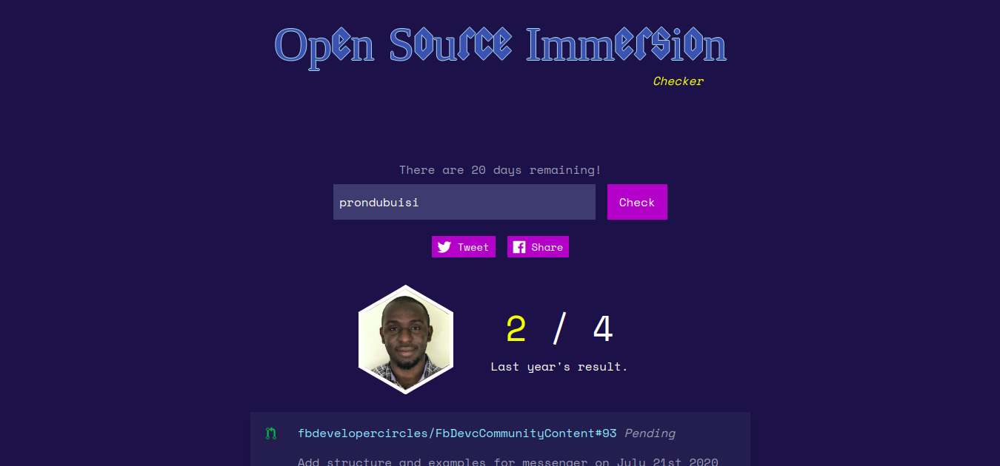

# Hacktoberfest Checker

Shout out to the original author of this project [Jenko](https://github.com/jenkoian), this is a modified version for the [Open Source Immersion programme](https://developers.facebook.com/developercircles/open-source-immersion/). This project is fan made and has no affliation with facebook.



Happy hacking!

## Requirements

* Node v10+
> Recommended to use [NVM](https://github.com/creationix/nvm)

## Running the app

* [Generate a GitHub personal access token](https://github.com/settings/tokens/new?scopes=&description=Hacktoberfest%20Checker) to ensure you don't get rate limited as often.

* Create a `.env` file using `.env.example` as an example. Or export the GitHub token as an environment variable for Node.js to use:
   * Mac/Linux: `export GITHUB_TOKEN=YOUR_TOKEN`
   * Windows (cmd.exe): `set GITHUB_TOKEN=YOUR TOKEN`
   * Windows (PowerShell): `$env: GITHUB_TOKEN=YOUR TOKEN`

* `$ npm install`

* `$ npm run tailwind-gen`

* `$ npm start`

* Point browser to [localhost:5000](http://localhost:5000)

Want to run the API server and the frontend in their processes? Use this:
```bash
$ npm run start-frontend
$ npm run start-server
```

or in a single command...

```bash
$ npm run start-development
```

